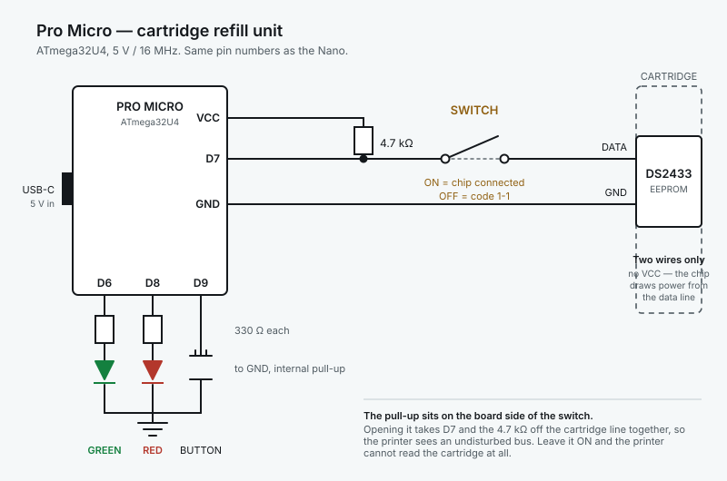

# Printable documentation

Two documents for the sealed unit, written for people who will never see the
firmware. Self-contained HTML — open in a browser, print from there.

| File | For | Notes |
|------|-----|-------|
| `placard.html` | The cartridge itself | 63 mm wide (fits a 65 × 140 mm face), prints at 100%, trim to the border |
| `handbook.html` | Whoever operates it | Full reference, including what to do for every code |
| `wiring-promicro.svg` | Whoever builds one | Pro Micro wiring, including the switch topology |

The diagram carries its own background rather than using `currentColor`, so it
stays legible in either GitHub theme — a standalone SVG has no page foreground
to inherit, and `currentColor` would render black on a dark ground.

Published copies:

- Placard — https://claude.ai/code/artifact/3e93e9cd-770a-4ea9-a4d8-3fe396200551
- Handbook — https://claude.ai/code/artifact/515b629a-ad5a-45d2-bce7-c89bfd769b2e

## They deliberately differ

The placard omits **2-1** (wrong printer type) and **4-1** (no backup stored).
Neither can occur once the unit is sealed to one known-good cartridge that has
been refilled at least once: it can only ever see that cartridge, and a backup
now exists, so a decode failure reports 2-2 instead. The handbook keeps both,
because it is the complete record rather than a field reference.

Everything else is kept on both, including codes that look like edge cases —
a blink code with no entry on the placard is worse than a line of small print.

## The one thing the diagram exists to show

The 4.7 kΩ pull-up sits on the **board side** of the switch. Opening the switch
therefore takes D7 *and* the pull-up off the cartridge line together, leaving the
printer an undisturbed bus. Wire the pull-up on the cartridge side instead and it
keeps loading the line with the switch open — the printer then reports a missing
or unreadable cartridge and nothing about the refill unit looks wrong.

The other claim it makes is why the firmware needs its parasite-power handling at
all: only two conductors cross into the cartridge, so the chip has no VCC and
draws everything from the data line.

## If the hardware changes

Both documents hard-code details of this specific build: the panel order
(green, red, switch, button, USB-C), the one-button gestures, USB-C power, the
chip switch, and the cartridge's own ID and capacity. Re-check them against
`src/main.cpp` after any pin or control change.
